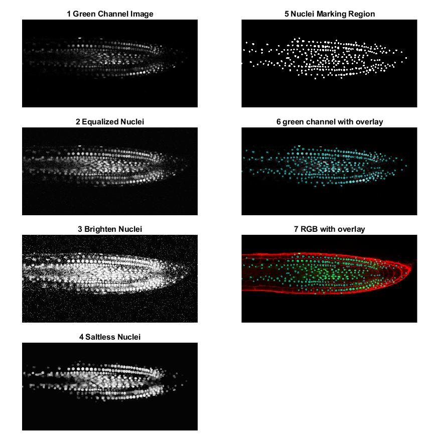
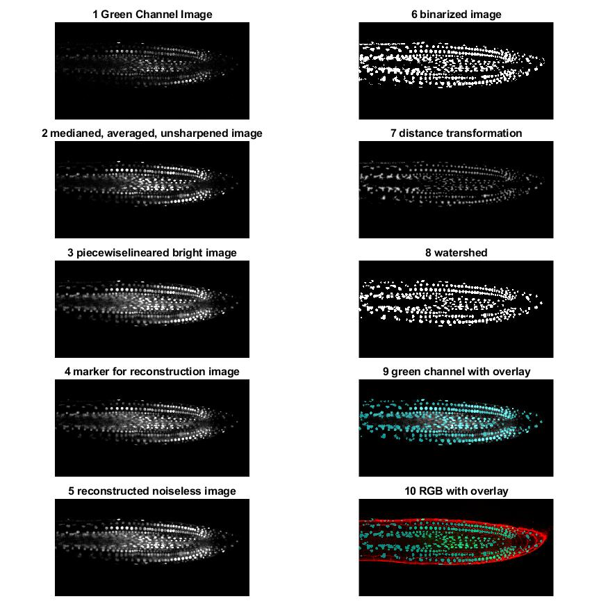
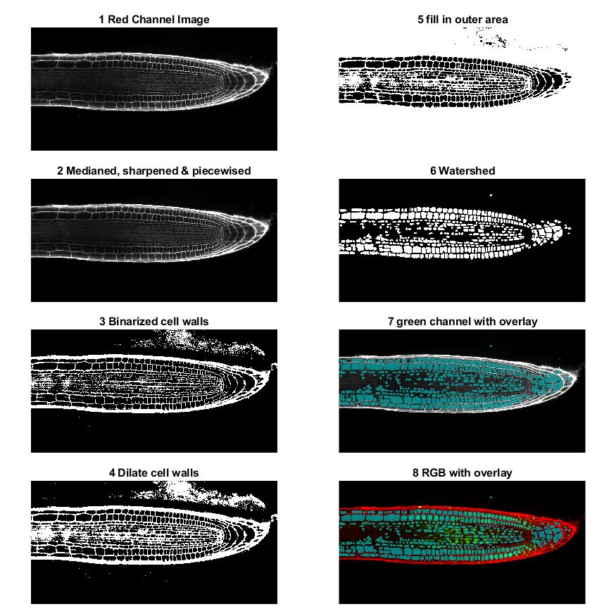
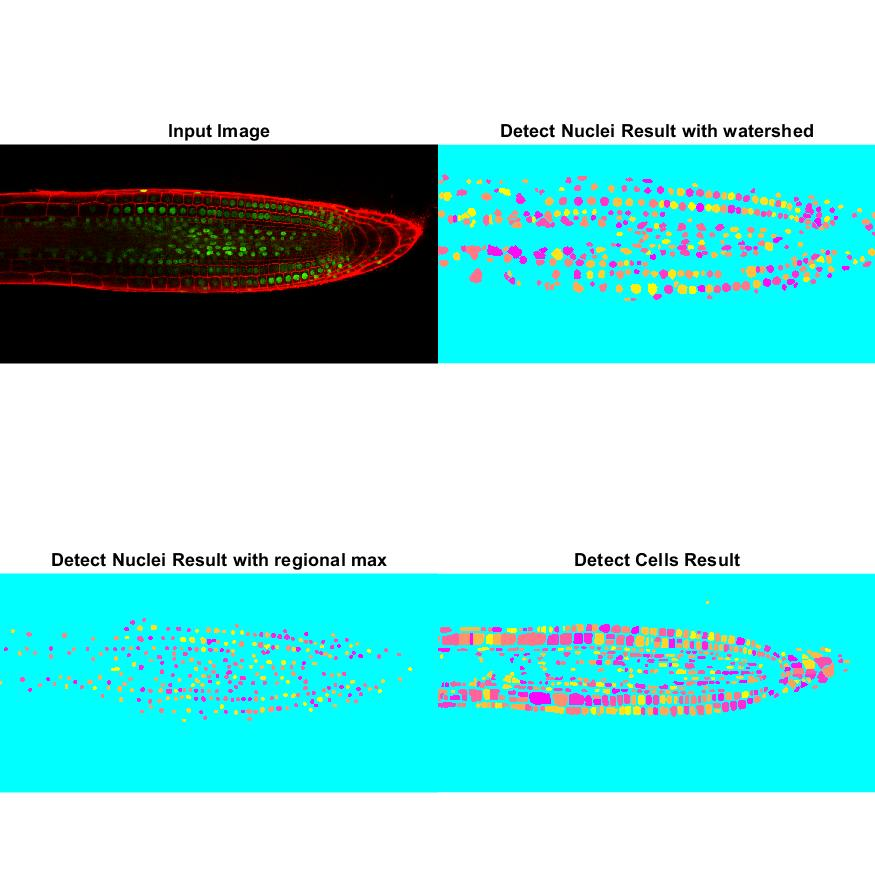

# Image Processing - plant illumination analysis

## Results

  
  
  
  

[Statistical Results](Report/Attachments/stackninja1_statistic.txt)

## USAGE
### Run Example Script 
1. Navigate the directory of MATLAB into the folder containing “main.m”
2. type "main" in the console and hit enter, it will run analysis using the first image.
3. Hit enter in the console to execute the next analysis of next image (there are 3 images in total)
### How to analyse other image
1. Place prefered image into [Image folder](Images)
2. call ``analyse_plant_illumination`` with specified image to generate the result
    > **see also**   
    > Example implementation [main.m](main.m)
